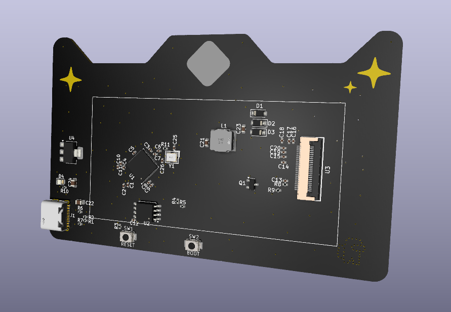
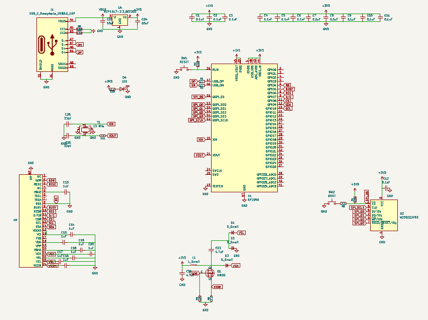
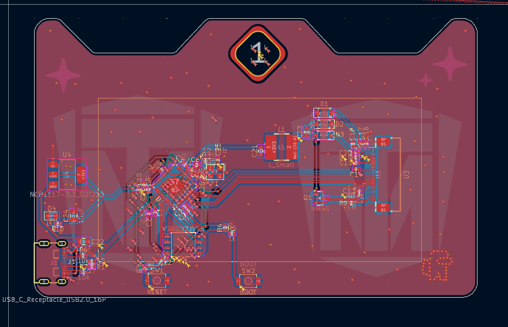

# Taranium Badge
PCB Badge made so I can learn how they work so I dont make ones that dont work for future hackathons. They use an e-ink display and are essentially your average hackathon badge. It features an RP2040 microcontroller and a 2.66" e-ink display.

## PCB

its a pcb! 2 layer board.

Features:
- RP2040 Microcontroller
- 4mb flash
- Powerless Functions - E ink lets it work without a power supply

### Schematic

Bottom left corner and bottom middle is everything related to the e-ink display. The rest is all microcontroller stuff.

### PCB Design

This is a 2 layer design that has a ground fill on both sides. I tried my best to route it cleanly but there might be some things off about it. I will update in the future if any errors are found

## Bill Of Materials

|Name|Qty|Price(USD)|Source|Link|
|----|---|-----|------|----|
|PCB|1|67.84|JLCPCB|[link](https://jlcpcb.com)|
|E-ink|1|14.25|GooDisplay|[link](https://buy-lcd.com/products/e-ink-display-high-resolution-gdey0266t90h)|
||Total|82.09|||

Extensive BOM for the PCB can be found [here](PCB/production/bom-JLCPCB%20Assembly%20Order.xls)

